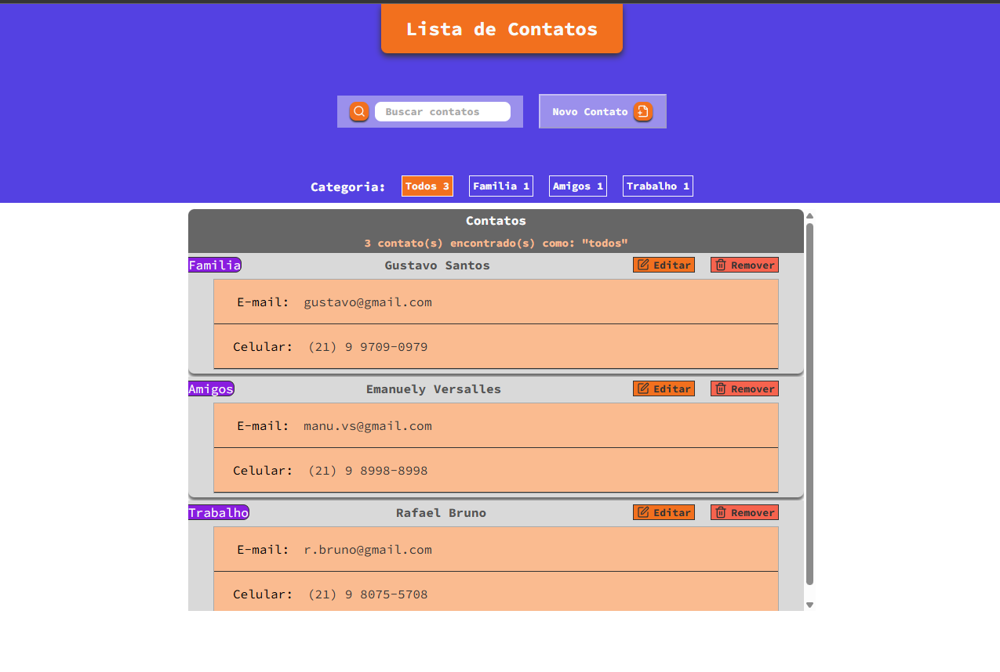
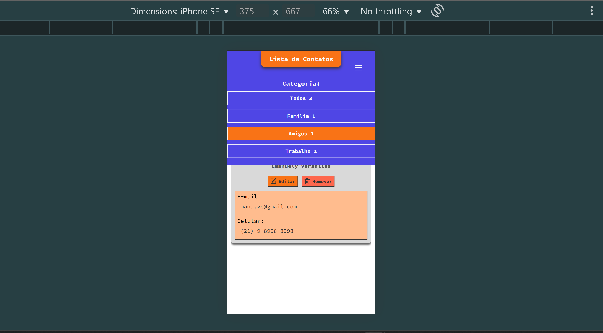
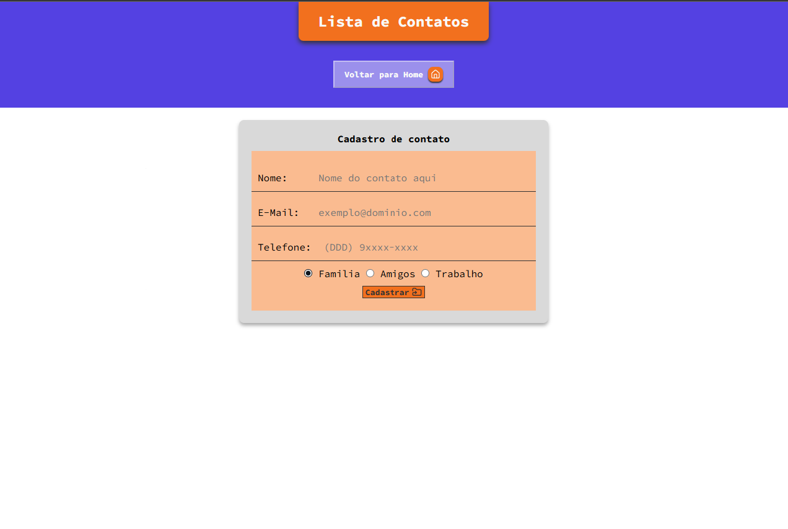
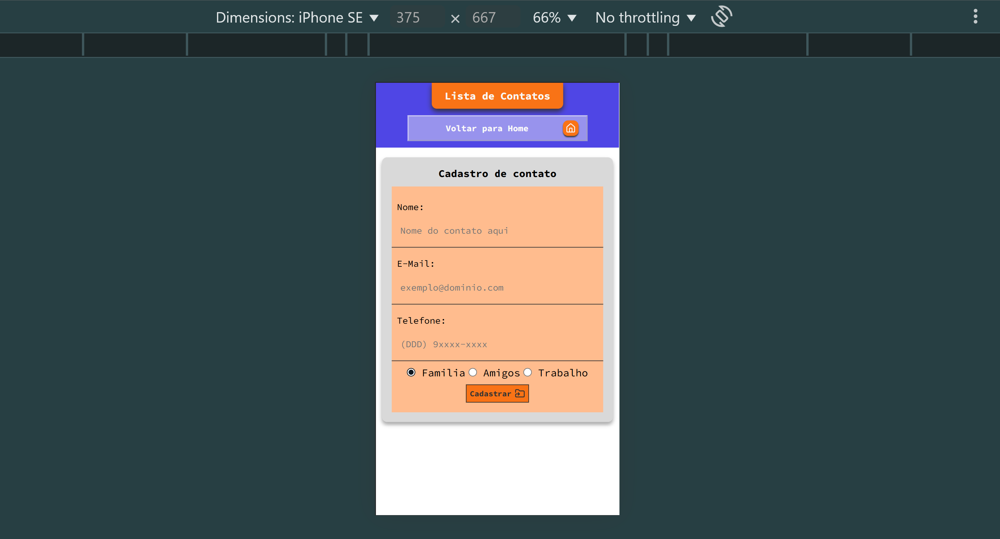
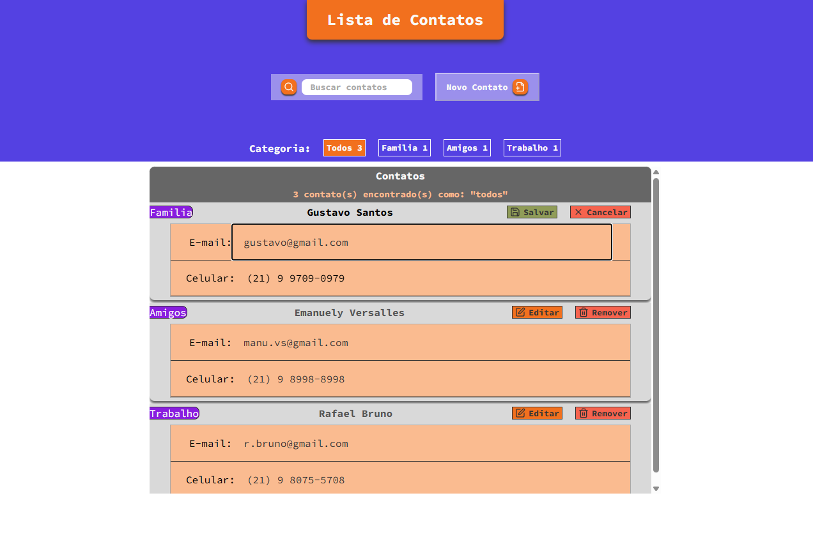

# 📇 Lista de Contatos

Aplicação desenvolvida em **React + TypeScript** durante o curso da [EBAC (Escola Britânica de Artes Criativas e Tecnologia)](https://ebaconline.com.br/), com foco em **Redux Toolkit, estilização modular e boas práticas de front-end**.  

O projeto simula uma **lista de contatos** que permite cadastrar, editar, excluir e filtrar contatos de forma prática e intuitiva.  

---

## ✨ Funcionalidades

- ➕ **Adicionar contato** com nome, e-mail, telefone e categoria.  
- 👀 **Visualizar contatos** em cartões dinâmicos e responsivos.  
- ✏️ **Editar informações** de contatos já cadastrados.  
- 🗑️ **Remover contatos** da lista.  
- 🔍 **Filtrar contatos** por categoria e/ou termo de busca.
- **Menu Hamburguer Responsivo**: Um menu retrátil para navegação das categorias em dispositivos móveis. 

---

## 🖼️ Layout

### 🔹 Tela Inicial


### 🔹 Tela Inicial Responsiva


### 🔹 Adicionar Contato


### 🔹 Adicionar Contato Responsivo


### 🔹 Editar Contato


---

## 🛠️ Tecnologias Utilizadas

- ⚛️ **React** – construção da interface  
- 🟦 **TypeScript** – segurança de tipos e robustez do código  
- 🗂️ **Redux Toolkit** – gerenciamento de estado global  
- 💅 **Styled Components** – estilização modular e dinâmica  
- 🌐 **React Router DOM** – navegação entre páginas  
- 🔢 **IMask.js + react-imask** – máscaras em inputs (ex.: telefone)  
- 🖌️ **Lucide Icons** – ícones leves e personalizáveis  

---

## 📚 Aprendizados

Durante o desenvolvimento deste projeto, aprimorei habilidades importantes:

- **Gerenciamento de Estado Global com Redux Toolkit**  
  Uso de `createSlice`, `useSelector` e `useDispatch` para compartilhar dados entre componentes.  

- **Formulários controlados**  
  Construção de inputs dinâmicos que mantêm a interface sincronizada com o estado da aplicação.  

- **Máscaras em formulários**  
  Aplicação de máscaras com `IMask.js`, manipulando valores "limpos" para salvar no estado e valores formatados para exibir ao usuário.  

- **Tipagem avançada com enums**  
  Uso de `enum` no TypeScript para categorias, evitando erros de digitação e facilitando manutenção.  

- **Estilização avançada com Styled Components**  
  Props dinâmicas, `transient props` (`$active`) e aplicação de estilos em componentes de terceiros.  

- **Refatoração e depuração**  
  Organização do código, simplificação de lógicas de filtragem e resolução de bugs relacionados à tipagem e renderização.
- **Comunicação entre Componentes Pai-Filho**
  Como passar funções como props para que um componente filho possa alterar o estado de um componente pai, criando uma experiência de usuário mais interativa e responsiva.  
  

---

## 💡 Exemplos de Uso dos Componentes

### **1. Home**
Renderiza o **Header** e a **Lista de Contatos**.

```tsx
import Header from '../../containers/Header'
import ContactList from '../../containers/ContactList'

const Home = () => (
  <>
    <Header showFilters={true} />
    <ContactList />
  </>
)

export default Home
```
---

2. AddContact

Página de cadastro de novos contatos, usando o AddForm.
```tsx
import Header from '../../containers/Header'
import AddForm from '../../containers/AddForm'

const AddContact = () => (
  <>
    <Header showFilters={false} />
    <AddForm />
  </>
)

export default AddContact
```
3. AddForm

Formulário controlado para adicionar contatos, integrado com Redux.

```tsx
import { useState } from 'react'
import { useDispatch } from 'react-redux'
import { register } from '../../store/reducers/contactsSlice'

const AddForm = () => {
  const dispatch = useDispatch()
  const [name, setName] = useState('')
  const [email, setEmail] = useState('')

  const handleSubmit = (e: React.FormEvent) => {
    e.preventDefault()
    dispatch(register({ name, email, phone: '', category: 'familia' }))
  }

  return (
    <form onSubmit={handleSubmit}>
      <input value={name} onChange={e => setName(e.target.value)} placeholder="Nome" />
      <input value={email} onChange={e => setEmail(e.target.value)} placeholder="E-mail" />
      <button type="submit">Cadastrar</button>
    </form>
  )
}
```
4. ContactList

Renderiza a lista de contatos filtrados pelo Redux.
```tsx
import { useSelector } from 'react-redux'
import Contacts from '../../components/Contacts'
import { RootReducer } from '../../store'

const ContactList = () => {
  const { itens } = useSelector((state: RootReducer) => state.contacts)

  return (
    <ul>
      {itens.map(contact => (
        <Contacts key={contact.id} {...contact} />
      ))}
    </ul>
  )
}

export default ContactList
```
5. Contacts

Cartão individual do contato, permite edição e remoção.
```tsx
import { useState } from 'react'
import { useDispatch } from 'react-redux'
import { edit, remove } from '../../store/reducers/contactsSlice'
import { Save, Edit, Trash2 } from 'lucide-react'

const Contacts = ({ id, name, email }) => {
  const dispatch = useDispatch()
  const [editing, setEditing] = useState(false)

  return (
    <div>
      {editing ? (
        <>
          <input value={name} onChange={e => {}} />
          <button onClick={() => dispatch(edit({ id, name, email }))}><Save /></button>
          <button onClick={() => setEditing(false)}>Cancelar</button>
        </>
      ) : (
        <>
          <span>{name}</span>
          <button onClick={() => setEditing(true)}><Edit /></button>
          <button onClick={() => dispatch(remove(id))}><Trash2 /></button>
        </>
      )}
    </div>
  )
}

export default Contacts
```
📂 Estrutura do Projeto
```bash
src/
├── components/ # Componentes reutilizáveis
├── containers/ # Seções principais (Header, Lista de Contatos, etc)
├── store/ # Redux Toolkit (slices e store)
├── styles/ # Estilos globais, temas e variáveis
└── App.tsx # Componente raiz
```
👨‍💻 Autor

Desenvolvido por Thiago Lopes 🚀
LinkedIn: www.linkedin.com/in/thiago-lopes-front-end

---

🚀 Como Executar
```bash
# Clone o repositório
git clone https://github.com/ThiagoLopesSantos/lista_de_contatos_react.git

# Acesse a pasta
cd lista_de_contatos_react

# Instale as dependências
npm install

# Rode o projeto
npm start
```
